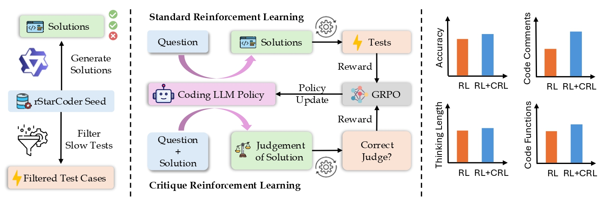

# Critique-Coder

| [**🚀Project Page**](https://tiger-ai-lab.github.io/ScholarCopilot/) | [**📖Paper**](https://arxiv.org/abs/2509.22824) | [**🤗Data**](https://huggingface.co/datasets/TIGER-Lab/rStar-Critique-Data) | [**🤗Model**](https://huggingface.co/collections/TIGER-Lab/critique-coder-68dbdcdf09dbf87ed11822e4) |

## Overview


## Get Started
### Installation
```bash
git clone https://github.com/TIGER-AI-Lab/Critique-Coder.git
cd Critique-Coder
conda create --name critique-coder python=3.10
conda activate critique-coder
pip install -e verl
pip install -e ".[vllm,acecoder]"
pip install "flash-attn<2.8.0" --no-build-isolation
```

### Dataset Preparation
```bash
hf download Critique-Coder/rStar-Critique-Data --local-dir ./data/critique-coder-dataset --repo dataset
```

### Training
```bash
bash examples/train/train_qwen3_4b_16k.sh
```
